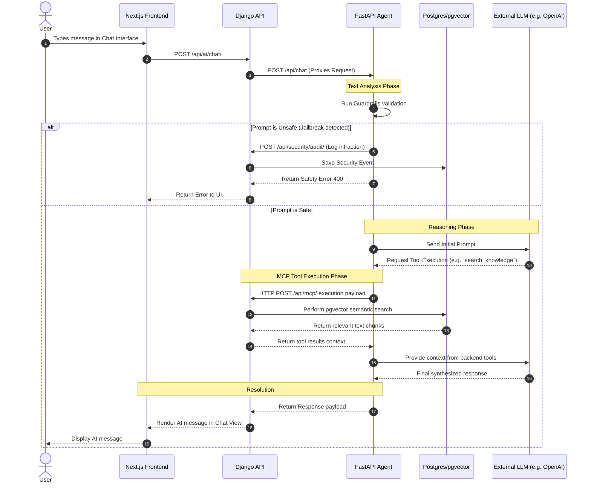

# System Architecture & Component Map

This document outlines the architecture, file connections, and functional flow of the AI Portfolio Project.

## 1. Directory Structure

```text
ai-portfolio/
|-- agent_service/         # FastAPI LangChain server
|   |-- api.py             # Agent API routing & endpoints
|   |-- agent.py           # Core LangChain implementation
|   |-- guardrails_config.py # Security validation logic
|   |-- mcp_tools.py       # MCP Tool declarations for the agent
|   \-- metrics            # Evaluation and metrics logic
|
|-- backend/               # Django API server
|   |-- core/              # Main Django project config & routing
|   |-- portfolio/         # Business logic (Roadmap, RAG, Logging)
|   |   |-- models.py      # Relational DB models
|   |   \-- utils/         # Helper functions (doc_loader, pgvector prep)
|   \-- mcp_server/        # MCP Protocol WebSocket/SSE handlers
|
|-- frontend/              # Next.js Presentation
|   |-- app/               # Next.js App Router (Pages)
|   |   |-- components/    # Reusable React components (UI, ChatWidget)
|   |   |-- learning/      # Learning Log views
|   |   |-- roadmap/       # Roadmap milestone views
|   |   \-- proxy/         # API routes bridging CORS to agent metrics
|   \-- public/            # Static assets
|
\-- docs/                  # Project Documentation (Markdown)
    |-- ARCHITECTURE_MAP.md
    \-- ...                # Setup, CI/CD, and Deployment guides
```


## 2. High-Level System Architecture

This diagram shows the structural relationship and network communication between the main containers/services.

```mermaid
graph TB
    %% Styling
    classDef frontend fill:#1e40af,stroke:#1e3a8a,stroke-width:2px,color:#fff
    classDef backend fill:#166534,stroke:#14532d,stroke-width:2px,color:#fff
    classDef agent fill:#0f766e,stroke:#115e59,stroke-width:2px,color:#fff
    classDef database fill:#b45309,stroke:#92400e,stroke-width:2px,color:#fff
    classDef external fill:#4b5563,stroke:#374151,stroke-width:2px,color:#fff

    %% Components
    subgraph Frontend [<b>Next.js Frontend (Port 3000)</b>]
        UI([Pages / UI Components])
        ChatWidget([AI Chat Interface])
        MetricsWidget([Neural Health Widget])
        NextProxy(Next.js Proxy Routes)
    end
    class Frontend,UI,ChatWidget,MetricsWidget,NextProxy frontend

    subgraph Backend [<b>Django Backend (Port 8000)</b>]
        DjangoAPI(Django REST API)
        MCP(MCP Server Endpoint)
        SecurityAudit([Security Audit Logger])
    end
    class Backend,DjangoAPI,MCP,SecurityAudit backend

    subgraph Agent [<b>FastAPI Agent (Port 8001)</b>]
        Langchain(LangChain Orchestrator)
        Guardrails(Security Guardrails)
        MCPTools(MCP Tool Executor)
        MetricsAPI(Metrics API)
    end
    class Agent,Langchain,Guardrails,MCPTools,MetricsAPI agent

    subgraph Data [<b>PostgreSQL (Port 5432)</b>]
        RelationalDB[(Relational DB)]
        VectorDB[(pgvector Embeddings)]
    end
    class Data,RelationalDB,VectorDB database

    LLM((LLM Provider HTTP API))
    class LLM external

    %% Connections
    UI ==>|REST requests for Roadmap/Logs| DjangoAPI
    ChatWidget ==>|POST /api/ai/chat/| DjangoAPI
    MetricsWidget -.->|Fetch stats| NextProxy
    NextProxy ==>|GET /metrics| MetricsAPI
    
    DjangoAPI ==>|POST /api/chat| Langchain
    Langchain ==>|Text Validation| Guardrails
    Guardrails -.->|Logs Violation POST| SecurityAudit
    
    Langchain ==>|Creates Prompt| LLM
    Langchain <==>|MCP Protocol JSON-RPC| MCP
    MCPTools --> MCP
    
    DjangoAPI <==> RelationalDB
    DjangoAPI <==> VectorDB
    SecurityAudit --> RelationalDB
```

## 3. Core AI Interaction Flow (Sequence)

This sequence diagram breaks down exactly what happens chronologically when a user interacts with the AI Chat. It visualizes the step-by-step connections.




## 4. Service Explanations & Key Files

> [!IMPORTANT]
> **Strict Architectural Boundaries:** 
> - **LLM Isolation:** Never add heavy LLM orchestration logic to the Django backend. All LangChain operations must remain inside the FastAPI Agent.
> - **Data Access:** The Agent Service must never query PostgreSQL directly. It must fetch data by executing MCP Tools that route through the Django API.

### Frontend (`c:\ai-portfolio\frontend`)
The presentation layer built with **Next.js**. It serves as the main interaction point for the user.
- **[`app/page.tsx`](file:///c:/ai-portfolio/frontend/app/page.tsx)**: Main landing page housing the AI Chat interface.
- **[`app/roadmap/page.tsx`](file:///c:/ai-portfolio/frontend/app/roadmap/page.tsx)**, **[`app/learning/page.tsx`](file:///c:/ai-portfolio/frontend/app/learning/page.tsx)**: Standard React views connecting directly to the Django API.
- **[`app/components/NeuralHealthWidget.tsx`](file:///c:/ai-portfolio/frontend/app/components/NeuralHealthWidget.tsx)**: Dedicated component visualizing agent performance metrics.
- **[`app/proxy/agent/metrics/route.ts`](file:///c:/ai-portfolio/frontend/app/proxy/agent/metrics/route.ts)**: API proxy resolving CORS gaps between Next.js and the internal Agent service port.

### Backend (`c:\ai-portfolio\backend`)
The core application server using **Django** and **Django REST Framework**. Unifies models and security logic.
- **[`core/urls.py`](file:///c:/ai-portfolio/backend/core/urls.py)**: Central routing (`/api/health/`, `/api/`, `/api/mcp/`).
- **[`portfolio/urls.py`](file:///c:/ai-portfolio/backend/portfolio/urls.py)**: API views handling frontend data requests.
- **[`mcp_server/urls.py`](file:///c:/ai-portfolio/backend/mcp_server/urls.py)**: Registers Model Context Protocol (MCP) endpoints for internal agent tool execution.
- **[`portfolio/utils/doc_loader.py`](file:///c:/ai-portfolio/backend/portfolio/utils/doc_loader.py)**: Script to embed documentation text into `pgvector` chunks.

### Agent Service (`c:\ai-portfolio\agent_service`)
An independent microservice built with **FastAPI**, isolating heavy LLM interactions from the backend.
- **[`api.py`](file:///c:/ai-portfolio/agent_service/api.py)**: Web socket and REST APIs for the agent (`/api/chat`, `/api/tools/execute`, `/metrics`).
- **[`agent.py`](file:///c:/ai-portfolio/agent_service/agent.py)**: The **LangChain** logic that establishes reasoning paths.
- **[`guardrails_config.py`](file:///c:/ai-portfolio/agent_service/guardrails_config.py)**: Input sanitization and jailbreak defense configurations before sending anything to an LLM.

### Database (`PostgreSQL Cluster`)
- **Relational Tables**: Accessed natively by Django ORM (Stores `LearningEntry`, `SecurityAuditLog`).
- **`pgvector` Extension**: Dedicated vectors for fast similarity calculation inside the portfolio knowledge base.